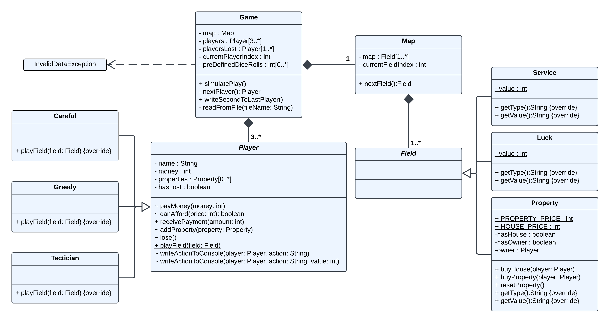

# 🎲 Capitaly Game Simulation

This project was developed as a **university assignment**, focusing on creating a simulation of the **Capitaly** board game. A detailed documentation is also available to guide users through the code and functionality of the game.

## 🚀 Features

- **Multiple Player Strategies**: Includes Greedy, Careful, and Tactician player types.
- **Dynamic Game Map**: Supports different field types like Property, Service, and Luck.
- **Console Output**: Utilizes ANSI escape codes for colored console output.
- **Predefined and Random Dice Rolls**: Supports both predefined sequences and random dice rolls.
- **Game Simulation**: Simulates the game until only one player remains.

## 📋 Project Details

- **University**: ELTE
- **Year**: 2024
- **Technologies**: Java

## 📚 Detailed Documentation

There is a detailed documentation included with a detailed tour to understand the code.

---

⭐ This was a university project and is not actively maintained.

